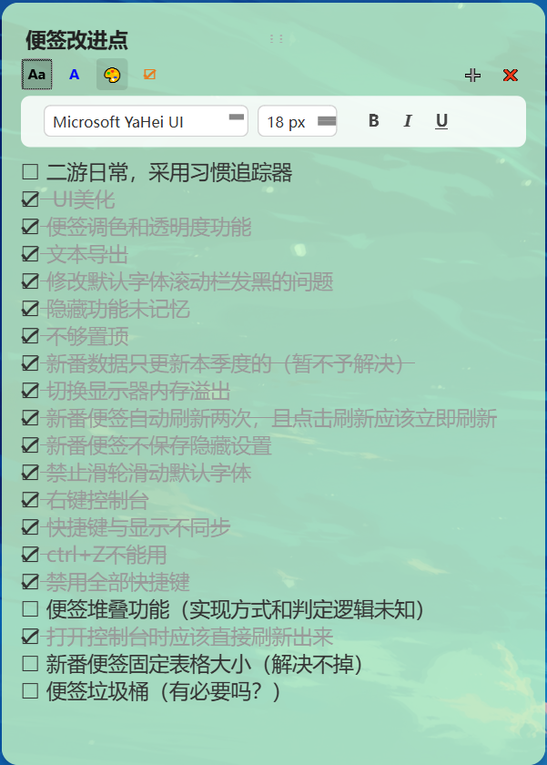
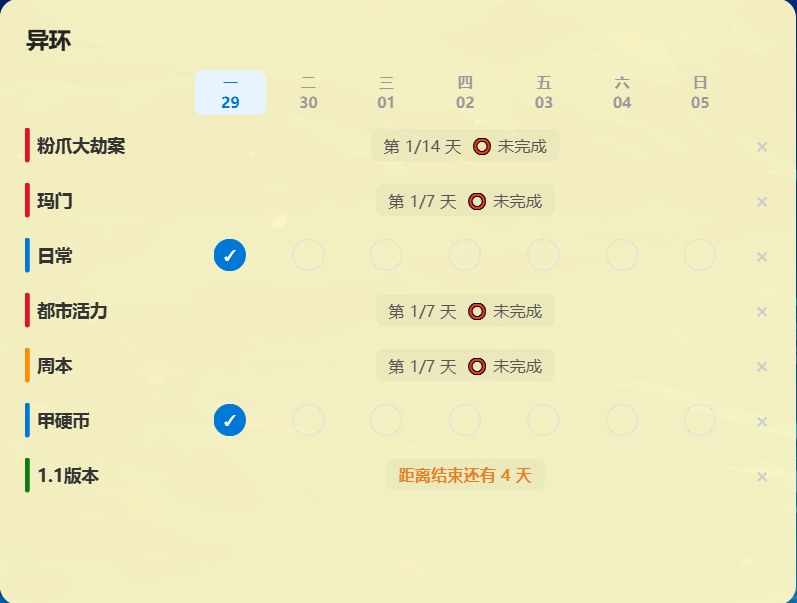
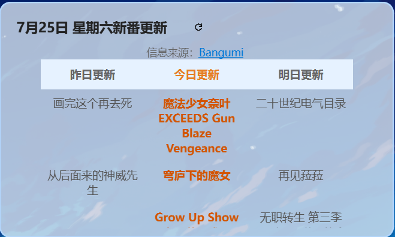
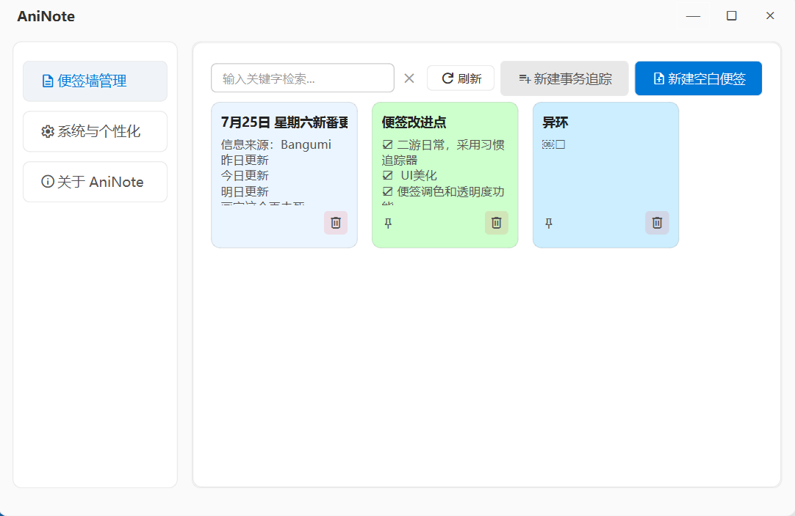
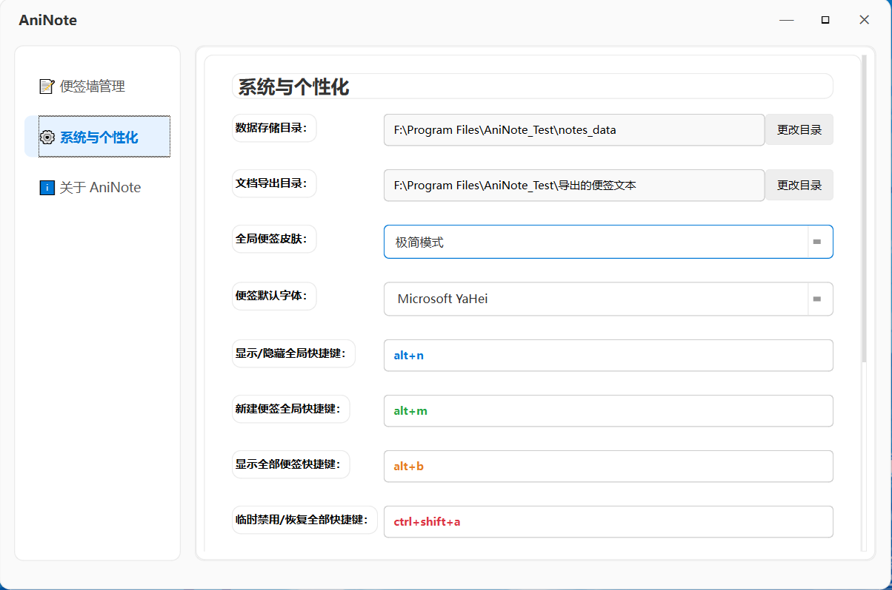

# AniNote

桌面便签工具，支持富文本编辑、待办事项、事务追踪、Bangumi 新番日历。

## 功能

- **桌面便签** — 无边框可拖拽缩放，支持锁定/置顶/隐藏
- **富文本编辑** — 粗体、斜体、下划线、字号、颜色、背景色，调色板自由选
- **Material Icons** — 统一使用 Google Material Symbols 图标，界面简洁一致
- **待办事项** — 快捷插入，点击切换完成状态

    

- **事务追踪器** — 自由打卡 / 周期循环 / 倒计时三种模式，周视图网格，支持拖拽排序，适用于二游日常提醒

    
    

- **Bangumi 新番** — 绑定 UID 后自动拉取在看番剧

    

- **网络代理接口** — 内置网络代理设置，解决 Bangumi 裸连无响应
- **便签墙管理** — 控制台集中浏览、搜索、打开/删除便签

    

- **便签导出** — 支持导出为 Word 文档（.doc），保留全部格式
- **全局热键** — 可自定义快捷键，新建/隐藏/显示/禁用

    
- **开机自启 / 系统托盘** — 不占任务栏，双击托盘图标呼出控制台

## 依赖

- Python 3.10+
- PySide6 >= 6.5
- requests

## 运行

```bash
git clone https://github.com/TurboHunter-CN/AniNote.git
cd AniNote
pip install PySide6 requests
python app.py
```

## 打包

```bash
python -m PyInstaller --noconsole --icon=Newicon.ico --add-data "Newicon.ico;." --add-data "MaterialSymbolsOutlined_Static.ttf;." app.py
```

分发 `dist/app/` 整个文件夹即可，对方无需安装 Python。

## 项目结构

```
AniNote/
├── app.py                            # 应用入口、热键、Bangumi 逻辑
├── main.py                           # 便签窗口、事务追踪器、配置
├── control_panel.py                  # 控制台 UI（便签墙、设置页）
├── icons.py                          # Material Icons 图标系统
├── theme.py                          # 设计系统常量
├── MaterialSymbolsOutlined_Static.ttf # 图标字体
├── Newicon.ico                       # 托盘图标 + 打包用 exe 图标
└── notes_data/                       # 便签数据目录（自动创建）
```

## 快捷键

| 操作 | 默认快捷键 |
|------|-----------|
| 新建便签 | Alt + M |
| 显示/隐藏全部 | Alt + N |
| 显示全部 | Alt + Shift + N |
| 临时禁用全部 | Ctrl + Shift + A |

快捷键可在控制台「系统与个性化」页面中自定义。

## 快捷键

| 操作 | 默认快捷键 |
|------|-----------|
| 新建便签 | Alt + M |
| 显示/隐藏全部 | Alt + N |
| 显示全部 | Alt + Shift + N |
| 临时禁用全部 | Ctrl + Shift + A |

快捷键可在控制台「系统与个性化」页面中自定义。

## API 使用说明

Bangumi 新番功能请求 [Bangumi Open API](https://bangumi.github.io/api/)。User-Agent 按官方规范声明开发者标识。

## License

MIT

## 写在最后

做这个小工具的初衷其实很简单。我发现现有的便签我用着都不习惯，更想要一个随叫随到的简约便签。

作者习惯于追新番，又是个二游痴。平时经常用Bangumi，偶尔忘掉二游里冗杂的任务。因此又加入了新番接口和事务追踪器。

（nnd软件做到一半Bangumi在国内突然就被墙了，不想割舍这一功能没办法又加入代理接口）

本人大学专业和代码只能说是毫无关系，是Vibe Coding的发展能让我这种代码白痴以产品经理身份出现在这。

本来只想做个自己用的东西，没想到愈发不可收拾，做到现在，又分享欲望爆棚来到Github。

无论是做软件还是发布开源代码，都是第一次体验，还请各位用户老爷多多包涵。

只要我个人的需求形成的这一产品能得到认同，那就是我最开心的事情了。

如果有任何绝妙的新灵感，或者遇到了 Bug，随时欢迎来 [B站@HunterHasCome](https://space.bilibili.com/499162799)找我反馈。

本人研究生在读，且并不怎么会弄Github，一切内容都是现学的，响应很慢还请原谅。
